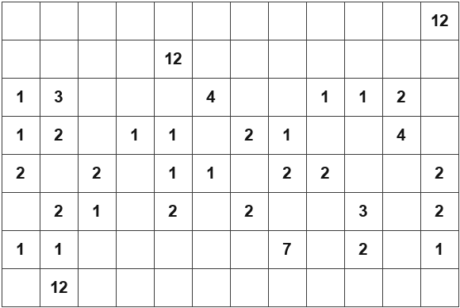
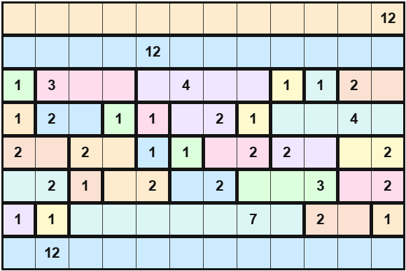

# inboxes-solver

A solver for [The Economist](https://www.economist.com/)'s **Inboxes** puzzle,
which is an implementation of the classic Japanese logic puzzle
[Shikaku](https://en.wikipedia.org/wiki/Shikaku): a grid of cells, some of
which contain a number, is partitioned into rectangles so that every
rectangle contains exactly one number, and that number equals the
rectangle's area.

Given a puzzle — as a screenshot or as JSON — this tool solves it
deterministically and renders the solution as a PNG.




## How it works

1. **Read the puzzle.** Either point the tool at a screenshot, which is sent
   to a vision-capable model on [OpenRouter](https://openrouter.ai/) to
   transcribe into a standardized JSON format, or hand it a puzzle already in
   that format directly. Screenshots are auto-cropped to their content and
   upscaled before transcription, since a puzzle grid is often a small
   fraction of a full phone screenshot. Every transcription is double-checked
   by actually solving it: a genuine Inboxes puzzle always has exactly one
   solution, so a decode producing something unsolvable or ambiguous is
   almost always a mis-transcription (a shifted clue, a miscounted row) — a
   failure here retries, then falls back across a short list of models,
   since a given model's mistakes on a given image tend to be a consistent
   habit rather than random noise (`inboxes.vision.FALLBACK_MODELS`).
2. **Solve it.** A deterministic constraint solver (`inboxes.solver`)
   enumerates every geometrically valid rectangle for each clue, then
   repeatedly eliminates candidates that conflict with already-placed
   rectangles and forces any clue left with only one option, backtracking
   over the remaining choices when needed. This is exact and fast — no LLM
   involved. An optional `--solver llm` mode is also available, which asks a
   model on OpenRouter to solve the puzzle directly; its answer is checked
   against the same validity rules before being accepted.
3. **Write the result.** The solution is saved as JSON (same format as the
   input, with each clue's rectangle bounds filled in) and rendered to a PNG.

## Standardized puzzle format

```json
{
  "rows": 8,
  "cols": 12,
  "clues": [
    {"row": 0, "col": 3, "value": 4},
    {"row": 6, "col": 9, "value": 7}
  ]
}
```

`row`/`col` are 0-indexed from the top-left of the grid. A solved puzzle adds
`r0`, `c0`, `r1`, `c1` to each clue: the inclusive top-left and bottom-right
corners of the rectangle assigned to it.

## Installation

```bash
python3 -m venv .venv
source .venv/bin/activate
pip install -r requirements.txt
```

Decoding a screenshot (or using `--solver llm`) requires an OpenRouter API
key. Create a `.env` file or export it directly:

```bash
OPEN_ROUTER_API_KEY=sk-or-...
```

## Usage

Solve a puzzle already in JSON form:

```bash
python -m inboxes --puzzle examples/sample_puzzle.json --out solution.json --png solution.png
```

Decode a screenshot first, then solve it:

```bash
python -m inboxes --screenshot puzzle.png --decoded-out puzzle.json --out solution.json --png solution.png
```

Solve with an LLM instead of the deterministic solver:

```bash
python -m inboxes --puzzle examples/sample_puzzle.json --solver llm --llm-model openai/gpt-5
```

Run `python -m inboxes --help` for the full list of options.

## Development

```bash
pip install -r requirements-dev.txt
pytest
```
